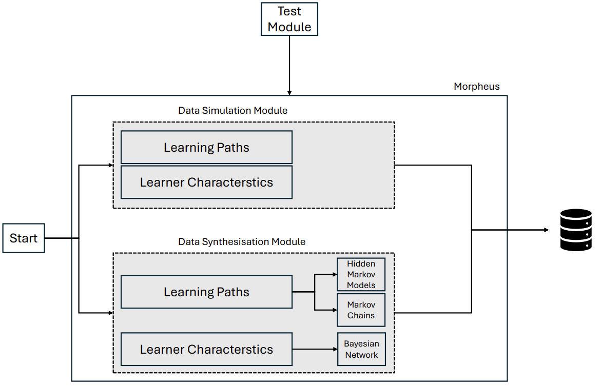

# Morpheus

## Name
Morpheus - data generator for realisitic learner profiles.

## Description
Similar to "Morpheus" - the Greek god who could craft realisitic visions - our data generator creates realisitc learner profiles like learner characteristics, learming paths which helps education researchers with rapid prototyping data-driven models, and also verify, validate and aanalyze software models.

### Overview
Morpheus is a synthetic data generator designed to create realistic learner profiles, including learner characteristics, learning paths, and more. Inspired by the Greek god Morpheus, who could craft realistic visions, this tool helps education researchers rapidly prototype data-driven models, verify and validate software models, and analyze various educational algorithms.

Data is the foundation of all machine learning applications, and generating high-quality learner data is especially challenging due to the difficulty in collecting diverse and unbiased samples. Morpheus addresses these challenges by utilizing probabilistic models like Bayesian Networks, Hidden Markov Models, and Markov Chains to synthesize complex learner profiles.

### Key Features:
Generate synthetic learner profiles based on real-world data collected from 593 students across several semesters.
Supports modeling of learning styles, strategies, personalities, and preferred learning paths.
Incorporates Bayesian Information Criterion and cross-validation to select the best models for data generation.
Provides simulation modules for user-defined learner profile creation.
Open-source and customizable for specific educational research needs.


## Badges


## Visuals
The following diagram illustrates the modular architecture of the Morpheus project. It details the interactions between different modules and their respective relations. This visual representation serves as a guide to understand how the various components communicate and collaborate within the system.


## Installation and Usage
To install and run Morpheus, follow these steps:

Clone the repository:
```bash
git clone https://github.com/username/morpheus.git
```

Install the required dependencies:
``` bash
pip install -r requirements.txt
```

Run the main script:
``` bash
python3 main.py --config.py
```


For training the models with your own data:
For learner characteristics:
``` bash
cd source\synthesizer\LChars\train\
python3 bn.py --path "path_to_custom_inputdata" --output_filename "name_to_save_trainedmodel" 
``` 
For learning paths:
``` bash
cd source\synthesizer\LPaths\train\
python3 learn_transition_probs.py --path "path_to_custom_inputdata" --output_filename "name_to_save_trainedmodel" --target_lstyle "sample_learningstyle"
```

For running the GUI and generating data:
``` bash
cd morpheus
python3 gui.py
```


For more detailed instructions, including setup options and additional features, refer to the 
```
examples/.
```

## Contributing
We welcome and encourage contributions from the community! If you'd like to contribute to this project, please follow these steps:

### How to Contribute? 
- Fork the Repository: Start by forking this repository to your GitHub account.
- Create a New Branch: Make your changes in a new branch:
``` bash
git checkout -b your-feature-branch
```
- Commit Your Changes: Commit your changes with clear and descriptive commit messages:
``` bash
git commit -m "Add detailed description of your changes"
```
- Push to Your Fork: Push the changes to your forked repository:
``` bash
git push origin your-feature-branch
```
- Submit a Pull Request: Open a Pull Request to the main repository from your feature branch. Please include a detailed description of your changes and any relevant context.

### Contribution Guidelines
Before submitting your pull request, please ensure that:

- Code Quality: Your code adheres to the PEP8 coding style guidelines. We recommend using linters like flake8 or black to automatically format your code.
- Test Coverage: Ensure your changes are well-tested with at least 80% overall test coverage. You can run tests locally and check the coverage by using:
``` bash
cd .\tests\
pytest --cov=your_module
```
- Documentation: Update documentation where necessary, especially if you add new features or modify existing functionality.

### Review and Merge
Once your pull request is submitted, it will be reviewed by one of our maintainers. We'll provide feedback if needed, and once everything is approved, your changes will be merged into the main branch.

Thank you for your contributions!
## Support
For any questions, feedback, or to report issues, feel free to reach out:
- Email: vamsi.nadimpalli@oth-regensburg.de or flemming.bugert@oth-regensburg.de
- Open an issue on GitHub Issues.

## Authors and acknowledgment
Morpheus was developed by:

- Vamsi Krishna Nadimpalli
- Flemming Bugert

Special thanks to the Federal Ministry of Education and Research through the funding project HASKI. In addition, to the students at OTH Regensburg for their valuable data contributions.

## License
This project is licensed under the GNU General Public License v3. See the [LICENSE](LICENSE) file for more details.

## Acknowledgements
The Federal Ministry of Research, Technology, and Space (BMFTR) supports this work by funding the
HASKI project (FKZ: 16DHBKI035).
<p align="center">
  
  &nbsp;&nbsp;&nbsp;
  
  &nbsp;&nbsp;&nbsp;
  
</p>


## Project status
If you have run out of energy or time for your project, put a note at the top of the README saying that development has slowed down or stopped completely. Someone may choose to fork your project or volunteer to step in as a maintainer or owner, allowing your project to keep going. You can also make an explicit request for maintainers.
